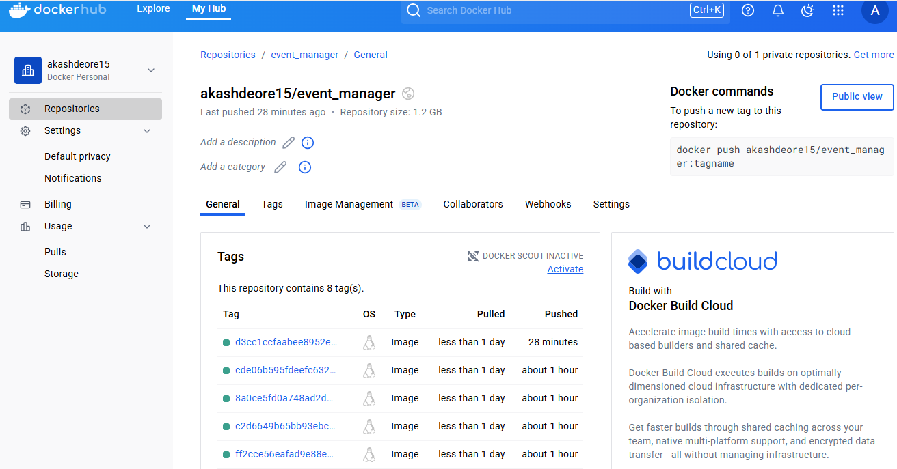
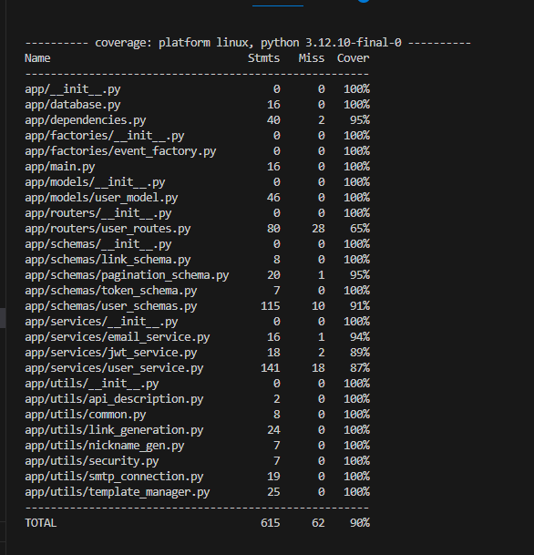

# Issues Fixed

[Issue 1](https://github.com/AkashDeore15/event_manager/issues/1)
[Issue 2](https://github.com/AkashDeore15/event_manager/issues/3)
[Issue 3](https://github.com/AkashDeore15/event_manager/issues/5)
[Issue 4](https://github.com/AkashDeore15/event_manager/issues/7)
[Issue 5](https://github.com/AkashDeore15/event_manager/issues/9)
[Issue 6](https://github.com/AkashDeore15/event_manager/issues/11)
[Issue 7](https://github.com/AkashDeore15/event_manager/issues/13)
[Issue 8](https://github.com/AkashDeore15/event_manager/issues/15)

# Docker Hub Image

[DockerHub Link](https://hub.docker.com/repository/docker/akashdeore15/event_manager/general)

# Test Coverage

# Reflection

Working on my "Event Manager" assignment was quite the ride—like diving headfirst into a maze of challenges that really pushed my limits. Debugging was a beast; trying to find tiny mistakes in the code felt like hunting for a needle in a haystack. But every time I found one, it was like finding a clue in a treasure hunt—it made everything that came after a little easier.

Using Git and GitHub was a game-changer for keeping everything straight. It was like having an ultra-organized assistant who kept track of all my changes and made sure I didn't step on my own toes, especially when I was juggling different branches and trying to keep everything in sync.

This assignment really stretched my skills in all directions. I got a lot deeper into REST API stuff and got my hands dirty with Docker, which opened up a whole new way of handling software. Pytest also became my go-to for making sure everything worked as expected before moving on.

Looking back, I see how much I've grown—not just in checking off tasks but in really leveling up my tech skills. It felt great to solve problems and find my way through complex code, and I've come out the other side more prepared and excited for whatever tech challenge comes next. It was a journey of learning and self-improvement, and honestly, I'm pretty proud of how far I've come. Ready for the next challenge—bring it on!
